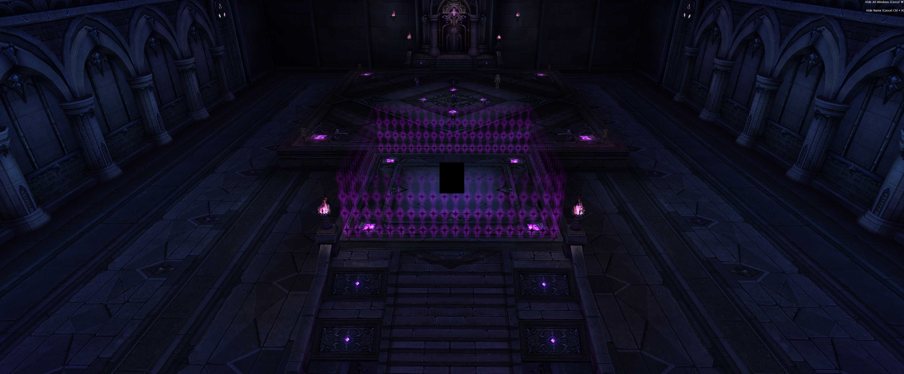
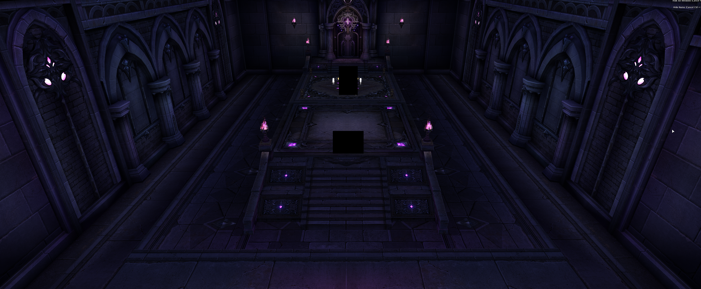

# CromBasZoomAndFoVAndDeclutter

## What it does:

Sets max zoom to it's maximum and set FoV at 45(Default), 60 or 90 depending on your chosen variant.
Removes all the props and fog in and around the rooms to help with lag and visibility.

### How it's made:

The .rgn files are opened with Mabioned and then the props are manually deleted from there. It also allows you to edit the embedded xml to set the zoom and FoV.

#### Example Images and GIFs:

