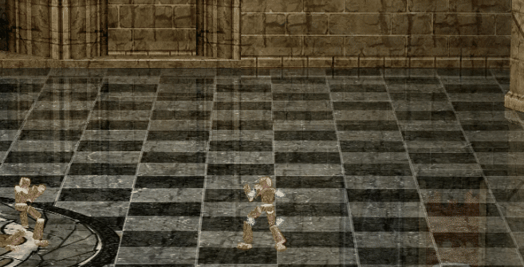

# Dark Diviner Timer

## What it does:

Removes most of the effects from vortex and replaces the center of vortex and the overhead ball from Thunderblight with a timer. Reduces the amount of extra particles in most DD skills.

### How it's made:

Swap some of the swirly animations out for the timer images.

#### Example Images and GIFs:

