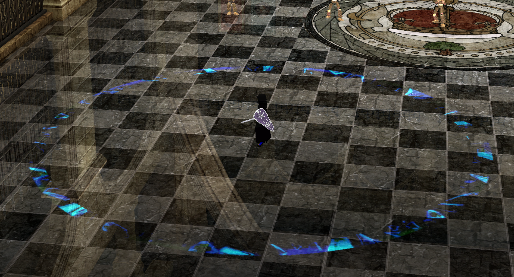

# Saint Guard Circle Simplification

## What it does:

removes all but the outer edge of the SG's circle and makes it a dark blue to keep it visible but unobtrusive.

### How it's made:

paint.net

#### Example Images and GIFs:

